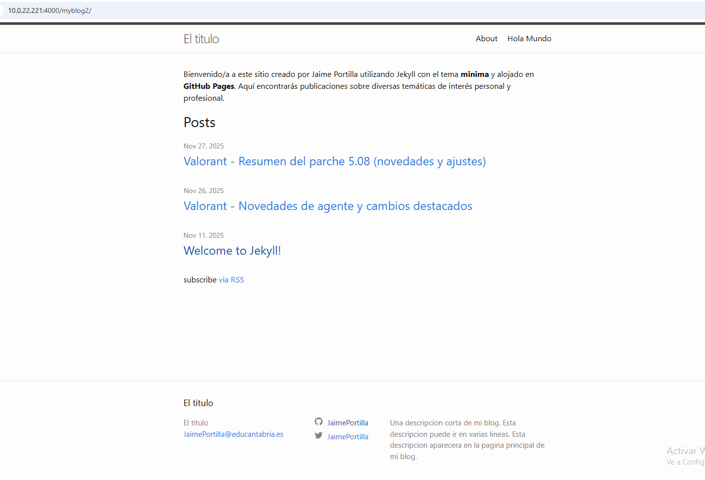

# Ejercicio 1: Jekyll con tema minima
## Requisitos previos
Para realizar este ejercicio es necesario tener Ruby instalado, ya que Jekyll funciona sobre él. Podemos instalarlo con los siguientes comandos:

`sudo apt-get install ruby-full build-essential zlib1g-dev`

`echo '# Install Ruby Gems to ~/gems' >> ~/.bashrc`

`echo 'export GEM_HOME="$HOME/gems"' >> ~/.bashrc`

`echo 'export PATH="$HOME/gems/bin:$PATH"' >> ~/.bashrc`

`source ~/.bashrc`

Una vez esté listo, instalamos Jekyll con:

`gem install jekyll bundler`

# 1. Creación inicial del sitio

Para generar la estructura del proyecto, creamos antes una carpeta con mkdir. Cuando estemos dentro del directorio, ejecutamos jekyll new . para que Jekyll prepare todos los ficheros necesarios del sitio web.

# 2. Creación del repositorio en GitHub

Tras generar el proyecto, debemos crear un repositorio en GitHub donde almacenaremos los archivos para poder publicarlos mediante GitHub Pages. Con el repositorio ya creado, conectamos nuestro directorio local con:

`echo 'git init`

`echo 'git remote add origin "nuestro token"`

`echo 'git branch gh-pages`


# 3 .Configuración del archivo _config.yml

Luego editamos el archivo de configuración principal. Los elementos más relevantes son:

title, para definir el título que aparecerá en la web.

baseurl, donde colocamos el nombre del repositorio para evitar conflictos con otras páginas desplegadas.

url, que indica la dirección donde se publicará.
En este caso, la dirección quedaría como:
https://JaimePortilla.github.io/myblog2


# 4. Edición de la página principal (index.markdown)

El archivo index.markdown contiene el texto que se va a visualizar en la página principal del sitio. Podemos editarlo para personalizar el contenido, añadiendo texto, imágenes y enlaces según nuestras preferencias.


Así se ve una vez subida a GitHub Pages:




# 5. Configuración de la sección “about” (about.markdown)

El fichero about.markdown sirve para mostrar información adicional, por ejemplo, datos del autor o detalles del proyecto.
En este ejercicio, el archivo contiene una breve presentación personal.


# 6. Posts

Los posts son las entradas o publicaciones del sitio. Cada una debe guardarse dentro de la carpeta _posts y escribirse en Markdown o HTML. El nombre del archivo debe seguir la estructura:
año-mes-dia-nombre-del-post.md.


Publicación en GitHub Pages

Cuando todo esté configurado y revisado, subimos el sitio al repositorio con:

```bash
git add .
git commit -m 
git push origin gh-pages
```