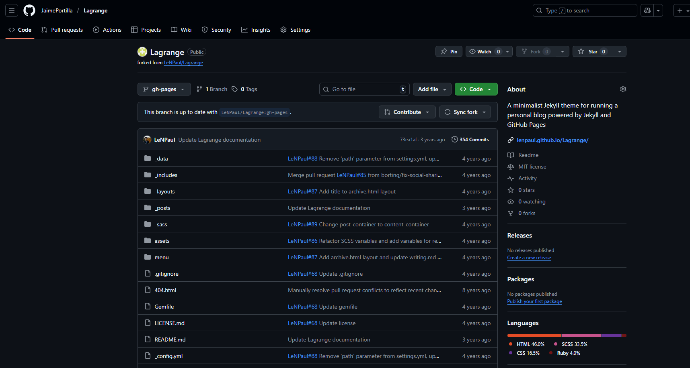
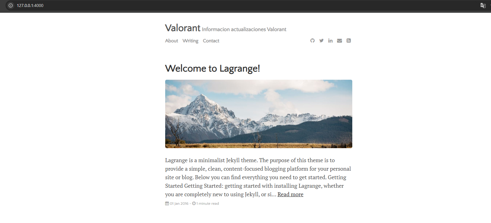

# Ejercicio 2: Jekyll con el tema Lagrange
# 1. Incorporar el tema Lagrange a mi cuenta de GitHub

Para comenzar a trabajar con el tema Lagrange, lo primero es acceder al repositorio original creado por LeNPaul en GitHub. Desde ahí, realizamos un fork para duplicarlo en nuestra cuenta personal. Una vez hecho esto, clonamos el repositorio en nuestra máquina virtual utilizando el comando git clone junto con nuestro token de autenticación para establecer el repositorio remoto.




# 2. Configuración principal del sitio (_config.yml)

El archivo _config.yml contiene todos los parámetros esenciales para personalizar el sitio web. Aquí podemos modificar el título del sitio (title), su descripción (description), los complementos que afectan su funcionamiento (plugins) y el nombre del autor (author), entre otros.


En la vista pública del sitio, el valor del campo author aparece en la parte inferior de la página.



# 3. Crear y editar publicaciones

Las entradas del blog, conocidas como posts, se muestran en la página principal. Cada una se escribe en formato Markdown o HTML y se guarda en la carpeta _posts. La estructura del encabezado (frontmatter) es similar a la del tema minima, y el nombre del archivo debe seguir el formato año-mes-día-título-del-post.md.


# 4. Personalizar la sección "Acerca de mí" (about.md)
Es común incluir una sección que describa el propósito del sitio o información sobre su autor. Esta sección se configura editando el archivo about.md, ubicado en la ruta /menu/about.md. Al igual que los posts, utiliza el mismo frontmatter que el tema minima.

Así se visualiza la sección About en el sitio:


# 5. Publicar los cambios en GitHub Pages
Una vez realizados los ajustes y añadidos los contenidos, podemos subirlos a GitHub Pages con los siguientes comandos:

````bash
git add .
git commit -m "Actualización del sitio con tema Lagrange"
git push origin gh-pages