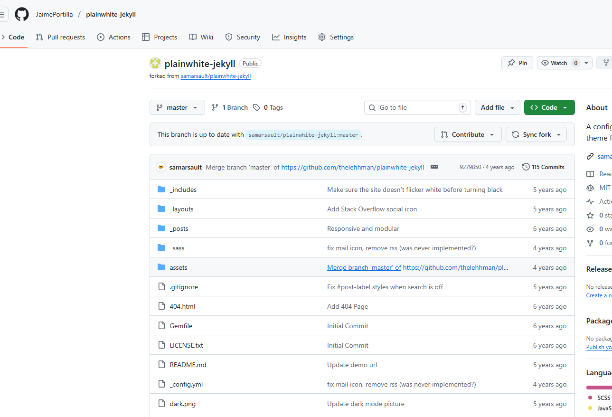
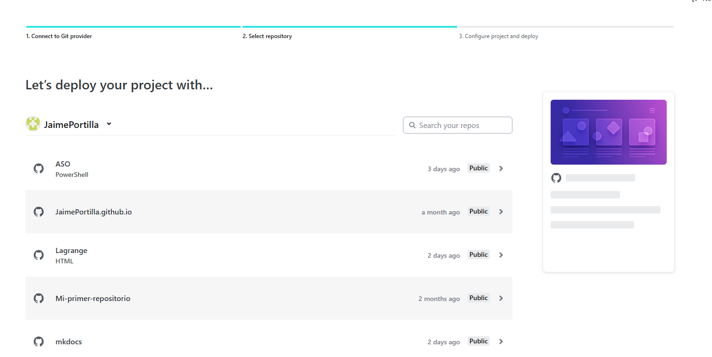
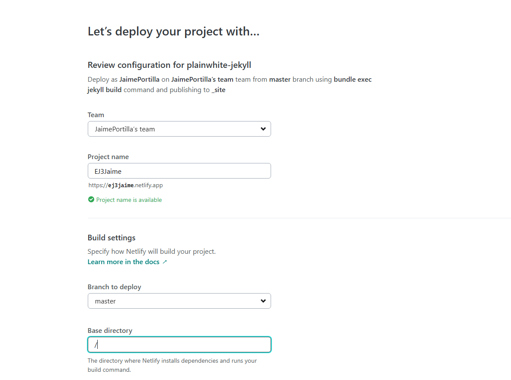
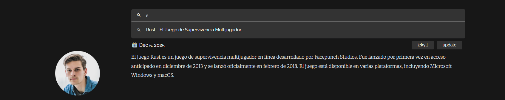

# Ejercicio 3
## Escoger un tema de Jekyll y despliegue en Netlify
# 1. Descarga del tema

Para este ejercicio he elegido el tema Satellite. Para poder utilizarlo es necesario hacer un fork del repositorio original y copiarlo a nuestra cuenta de GitHub.


 

# 2. Preparación del proyecto en Netlify

Una vez dentro de la pagina Netlify, iniciamos sesión. A continuación, Netlify nos pedirá desde qué plataforma queremos importar el repositorio, elegimos GitHub y seleccionamos el repositorio del tema que hemos clonado anteriormente.




Después configuramos el nuevo sitio: asignamos un nombre que formará parte de la URL, establecemos el directorio base como / y dejamos la rama por defecto.



# 3. Archivo de configuración del tema (_config.yml)

El archivo de configuración contiene la información general que se mostrará en el sitio, como el nombre, el logotipo o los enlaces sociales.


# 4. Publicación de entradas

Las entradas del blog se encuentran en la carpeta _posts.


Ejemplo de la pagina


Luego deberemos de buscar el post



Asi se veria el post


# 5. Publicar el sitio
Una vez realizados los ajustes y añadidos los contenidos, podemos subirlos a GitHub Pages con los siguientes comandos:

````bash
git add .
git commit -m "Actualización del sitio con tema Lagrange"
git push origin gh-pages